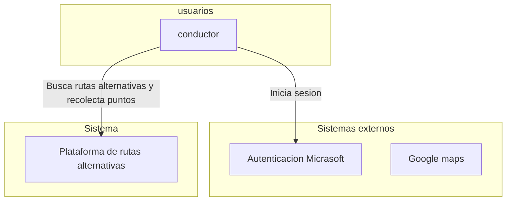

# Especificación de Requisitos de Software  

**Proyecto:** Plataforma para la gamificación con rutas alternativas en Bogotá  

---

# Ficha del documento  

| Fecha      | Versión | Autor          | Verificado | Observaciones        |
|------------|---------|----------------|------------|----------------------|
| 2025-09-04 | 0.1     | William Torres | —          | Documento inicial    |

---

## Contenido  

1. Introducción  
   1.1 Propósito  
   1.2 Alcance  
   1.3 Personal involucrado  
   1.4 Definiciones y acrónimos  
   1.5 Referencias  
   1.6 Resumen  
2. Descripción general  
   2.1 Perspectiva del producto  

---

## 1 Introducción  

Este documento describe los requisitos de software para una plataforma que usa **gamificación** con el fin de motivar a los ciudadanos de Bogotá a utilizar rutas alternativas en sus desplazamientos. Servirá como guía para clientes y para el equipo de desarrollo, dejando claros los objetivos, funciones y limitaciones del sistema.  

### 1.1 Propósito  

Definir qué debe hacer el sistema, sus funciones principales y sus restricciones. El documento ayuda a que clientes y desarrolladores compartan una misma visión del proyecto.  

### 1.2 Alcance  

El sistema permitirá:  
- Registrar usuarios y crear perfiles.  
- Consultar rutas alternativas en Bogotá.  
- Participar en retos, sumar puntos e insignias.  
- Ver estadísticas personales y rankings.  
- Administrar retos y usuarios desde un panel web.  

**Incluye:** backend, base de datos, portal web y panel administrativo.  
**No incluye:** apps móviles, pagos ni conexión en tiempo real con datos de tráfico (se podrán agregar después).  

### 1.3 Personal involucrado  

| Nombre         | Rol          | Responsabilidad                                   | Contacto                         |
|----------------|--------------|---------------------------------------------------|----------------------------------|
| William Torres | Desarrollador| Diseñar y construir el backend y la base de datos | Wfernandotorres@ucompensa.edu.co |

### 1.4 Definiciones y acrónimos  

| Término | Descripción |
|---------|-------------|
| Usuario | Persona que usará el sistema. |
| ERS     | Especificación de Requisitos de Software. |
| RF      | Requerimiento Funcional. |
| RNF     | Requerimiento No Funcional. |

### 1.5 Referencias  

- IEEE 830 – Guía para documentos de requisitos de software.  

### 1.6 Resumen  

La plataforma permitirá a los ciudadanos de Bogotá usar rutas alternativas a través de un sistema de puntos y retos. El documento detalla qué se espera del sistema y servirá como guía en el desarrollo.  

---

## 2 Descripción general  

### 2.1 Perspectiva del producto  

El sistema tendrá dos partes principales:  
- **Portal web para usuarios**, donde podrán ver rutas, retos y estadísticas.  
- **Panel administrativo**, donde se gestionan retos y usuarios.  

El backend expondrá servicios API seguros y será la base para futuras extensiones como aplicaciones móviles o integraciones externas.  

